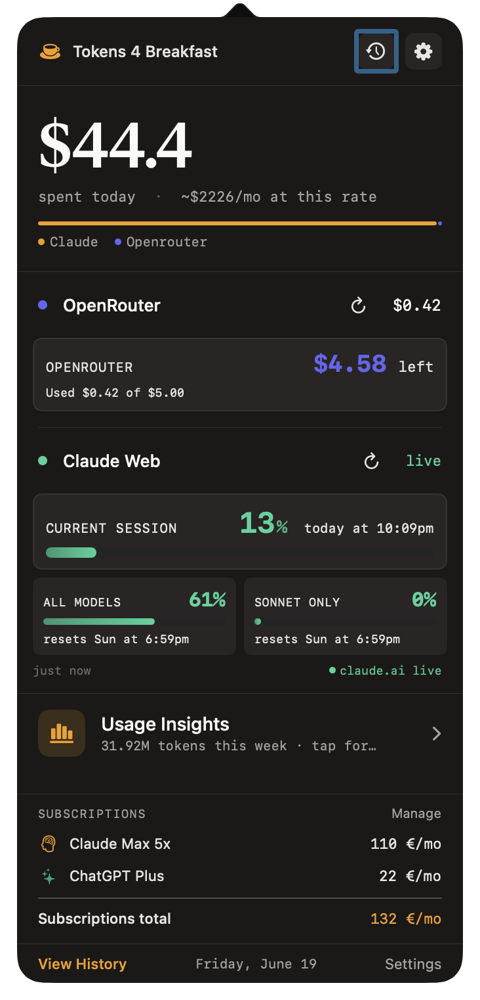
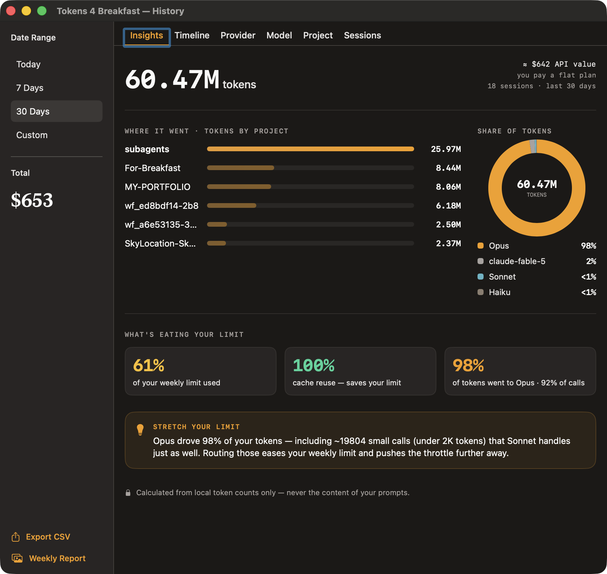

# ☕ Tokens 4 Breakfast

### Track tokens and AI subscriptions across major platforms.

Track **token usage, spend, subscriptions, and rate-limit pressure** across **8 AI providers** (Claude Code, OpenAI, Cursor, GitHub Copilot, Gemini, DeepSeek, Mistral, and OpenRouter), all from one private Mac menu bar app. **100% local. No account. One-time $7.99.**

### [⬇️ Download Free for macOS](https://www.tokens4breakfast.app/download?source=github_readme) · [🌐 Website](https://www.tokens4breakfast.app) · [💬 Report a bug / request a feature](https://github.com/onekapisch/Tokens4Breakfast-daily/issues/new/choose)

&nbsp;&nbsp;

---

> [!NOTE]
> **Tokens 4 Breakfast is a commercial, closed-source macOS app.** This repository hosts the public **changelog, releases, docs, and issue tracker**, not the app's source code. Bug reports and feature requests are very welcome right here in [Issues](https://github.com/onekapisch/Tokens4Breakfast-daily/issues).

## Why

If you build with AI, your spend is scattered across a dozen tools and your real bill is invisible until the invoice lands. Two things go wrong:

- **💸 Surprise bills.** Claude API + ChatGPT Plus + Cursor + Copilot + a few API keys, and nobody adds it up until it hurts. T4B users routinely find **$40+/month they forgot was running**, on day one.
- **🚧 Rate limits mid-session.** You hit the Claude Code 5-hour window at the worst possible moment, with no warning.

Existing options are a **CLI** (great, but lives in the terminal and is usually one provider) or a **single-provider menu bar gauge**. Tokens 4 Breakfast puts **all 8 providers, real spend, subscriptions, and rate-limit runway** in one place that stays visible while you work.

## What you get

- 📊 **Live spend in the menu bar:** today's cost and a month-end projection, updated as you work.
- ⏳ **Claude Code 5-hour window timer:** see your rate-limit runway *before* it cuts your session.
- 🧩 **8 providers in one view:** Claude Code, OpenAI, Cursor, GitHub Copilot, Gemini, DeepSeek, Mistral, OpenRouter.
- 🧾 **AI subscription tracking:** Claude Pro/Max, ChatGPT Plus, Cursor, Copilot, and more, sitting next to your usage-based costs.
- 🎯 **Focus Mode session budgets:** catch runaway agent loops before they spike the bill.
- 📈 **Usage Insights:** where every token goes, by **project** and **model**.
- 🛟 **Per-provider daily & weekly budgets** with alerts.
- 🔒 **100% local:** a local SQLite DB on your Mac. No account, no cloud, no telemetry. Built in Germany.

## Supported providers

| Provider | How it connects |
|---|---|
| **Claude Code** (Anthropic) | Automatic, from local session files (no API key) |
| **GitHub Copilot** | Local Copilot CLI credentials |
| **OpenAI · Cursor · Gemini · DeepSeek · Mistral · OpenRouter** | One API-key paste in Settings |

**Free:** 1 provider of your choice, no time limit. **Pro ($7.99 one-time):** all 8 unlocked.

## How it compares

The honest version: these tools are good; they solve a narrower slice.

| | ccusage | CodexBar / ClaudeBar | Provider dashboards | **Tokens 4 Breakfast** |
|---|---|---|---|---|
| Interface | CLI (terminal) | Menu bar | Web, after the fact | **Native Mac menu bar** |
| Providers | Claude-focused | Single provider | One per dashboard | **8 in one view** |
| Real $ spend | Usage | Quotas | Per-provider | **Unified spend + forecast** |
| AI subscriptions | ✗ | ✗ | ✗ | **✓** |
| Budgets / session caps | ✗ | ✗ | ✗ | **✓ (Focus Mode)** |
| Local / private | ✓ | ✓ | ✗ (cloud) | **✓ no account, no telemetry** |
| Price | Free / OSS | Free / OSS | Included | **Free plan · $7.99 one-time** |

➡️ A [ccusage GUI alternative](https://www.tokens4breakfast.app/alternatives/ccusage-gui) · a [CodexBar alternative](https://www.tokens4breakfast.app/alternatives/codexbar-alternative). Full breakdowns on the site.

## Privacy & security

Your prompts and code never leave your machine. Claude Code is read from local logs; other providers are queried with **your own API keys**. No telemetry, no analytics, no third-party calls beyond the providers you connect. See [SECURITY.md](SECURITY.md) for the full data-flow.

## Install

1. **[Download the latest release](https://www.tokens4breakfast.app/download?source=github_readme)** (~12 MB).
2. Unzip and drag **Tokens 4 Breakfast** to `/Applications`.
3. Launch it, click the menu bar icon, connect a provider (~2 minutes).

**Updating:** built-in auto-update (Sparkle). **Uninstalling:** quit the app and move it to Trash; all data is local (`~/Library/Application Support/Tokens 4 Breakfast`).

**Requirements:** macOS 14.6 Sonoma or later · Apple Silicon & Intel.

## Roadmap & feedback

Roadmap is demand-driven. Requesting a provider or a feature? **[Open an issue](https://github.com/onekapisch/Tokens4Breakfast-daily/issues/new/choose)**. It's the fastest way to influence what ships next.

## FAQ

**Is it open source?** No, it's a commercial app. This repo is docs / releases / issues.  
**Why pay when ccusage is free?** ccusage is a great Claude-focused CLI; T4B is a native GUI across 8 providers that also tracks spend, subscriptions, and budgets.  
**Does it send my data anywhere?** No telemetry; only the provider APIs you connect, with your own keys.  
More: **[full FAQ →](https://www.tokens4breakfast.app/faq)**

---

**⭐ If this looks useful, star the repo. It genuinely helps other builders find it.**

[Website](https://www.tokens4breakfast.app) · [Download](https://www.tokens4breakfast.app/download?source=github_readme) · [FAQ](https://www.tokens4breakfast.app/faq) · [Privacy](https://www.tokens4breakfast.app/privacy)

